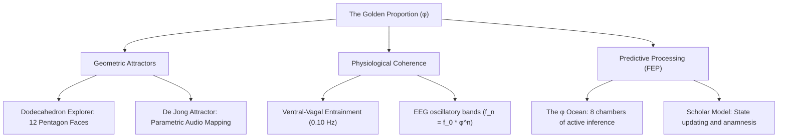

# The Resonance of φ :: Harmonic Stabilizer of the HIA Ecosystem

This document maps the structural, mathematical, and somatic presence of the Golden Proportion ($\phi$) within the HIA (Human Development Mathematics) ecosystem, centering on the **Phi-String Abacus** (`/explorers/phi-explorer.html`) and its expansion into **The φ Ocean**.

---

## :: THE CORE LANDING PORTAL :: The Phi-String Abacus

The `/explorers/phi-explorer.html` laboratory functions as a direct somatic and geometric attunement space. Rather than explaining the Golden Proportion, it invites the scholar to experience its properties through visual feedback, active interaction, and generative audio.

### 1. Visual & Mathematical Layout
The explorer presents four distinct axes of inquiry:
*   **The Proportion Slider (The Golden Split):** An interactive divider where the scholar drags a slider to partition a line. At the precise golden division ($61.8034\%$), the ratio of the whole to the larger segment matches the ratio of the larger to the smaller. This action triggers a specific attunement.
*   **The Golden Spiral:** An animated canvas that draws consecutive Fibonacci squares. It demonstrates how geometry tightens toward a central still point while expanding outward.
*   **The Pentagram Star (Inside Every Face):** Illustrates a regular pentagon, representing a single face of the dodecahedron. It highlights that the diagonals intersect at exact $\phi$-ratios, creating recursive inner stars.
*   **Fibonacci's Convergence Table:** A quantitative display of consecutive Fibonacci ratios approaching $\phi$, visualizing an oscillation that narrows toward the ideal proportion.

### 2. Sonic Architecture (Tone.js Engine)
The Phi-String Abacus uses Tone.js to attune the workspace. Its parameters adapt dynamically based on the active **MaGNET** state in `localStorage` (`ellian`, `curator`, `gleam`, or `default`):
*   **Ellian Register:** Triangle waves with long attack/decay, lowpass filtering at $950\text{ Hz}$, and a $0.375\text{ s}$ feedback delay.
*   **Curator Register:** Sine waves, rapid attack, moderate decay, lowpass filtering at $1200\text{ Hz}$, and a $0.25\text{ s}$ feedback delay.
*   **Gleam Register:** Sine waves with long attack, wide-open filter, extensive reverb ($7.0\text{ s}$ decay, $75\%$ wet), and a $0.25\text{ s}$ feedback delay.
*   **Default Register:** Sine waves with moderate decay, open filter, and $0.375\text{ s}$ feedback delay.

### 3. Sonic Frequencies & Tones
*   **Base Root:** The system is tuned to $144.0\text{ Hz}$ (a harmonic octave of the HIA $288\text{ Hz}$ root).
*   **The Golden Mean Attunement:** Triggered when the scholar finds the exact golden split ($61.8\%$). It plays a cascading 5-note chord on the golden harmonics:
    $$f_n = 144.0 \times \phi^n \quad (\text{for } n \in \{0, 1, 2, 3, 4\})$$
*   **Step-by-Step Tones:** As the Fibonacci spiral unfurls, each step plays a tone corresponding to $144.0 \times \phi^{\text{step}}$, providing direct acoustic confirmation of logarithmic scaling.

---

## :: THE HIA ECOSYSTEM :: Where φ Makes Itself Harmonically Known

The presence of $\phi$ extends beyond a single explorer. It serves as the **Harmonic Boundary Condition** that coordinates the geometry, physiology, and consciousness mapping of the HIA.

### 1. Dodecahedron Explorer (`/explorers/dodecahedron-explorer.html`)
The centerpiece of the ecosystem is the 3D rotating dodecahedron.
*   **Structural Geometry:** Composed of 12 regular pentagons, the entire structure is physically defined by $\phi$.
*   **Resonant Overtones:** When a face is hovered, the Web Audio engine generates golden-ratio overtones to enrich the fundamental tone:
    $$\text{Overtone}_1 = \text{Freq} \times \phi$$
    $$\text{Overtone}_2 = \text{Freq} \times (\phi - 1)$$
    This generates a shimmering, self-similar acoustic texture.

### 2. De Jong Attractor (`/explorers/dejong-attractor-explorer.html`)
*   **Parametric Sound Mapping:** As the strange attractor morphs, its equations generate sound waves where parameter variables are mapped to frequencies using exponential $\phi$-scaling:
    $$f = 55.0 \times \phi^{\frac{p + 3}{2}}$$
*   **Phi-Ease Transition:** The visual brightness and morphing interpolation use a custom `phiEase(t)` function to ensure changes feel organic.

### 3. The 12-Face Audio Profiles (V2 Steeperverse Architecture)
As outlined in the V2 audio integration brief, the 12 faces map to elemental sound profiles that employ $\phi$ to define decay times and feedback parameters, ensuring each face rings with physical texture.

---

## :: NEUROLOGICAL & PHYSIOLOGICAL SUBSTRATES

The HIA operates on the premise that $\phi$ is the stabilizer of biological phase-states. This is supported by direct observations within the *Coherence Compendium*:

### 1. The Resting EEG Oscillation Grid
Research by Pletzer, Kerschbaum, and Klimesch (2010) demonstrates that the human brain organizes its key resting EEG frequency bands (delta, theta, alpha, beta, gamma) as a geometric series with ratio $\phi \approx 1.618$. Because their ratios are golden, their phase peaks rarely align, which prevents destructive cross-frequency interference. $\phi$ acts as the natural barrier against spurious coupling.

### 2. Cardiac Pulse Waveforms
Arterial pressure waves decompose into systolic and diastolic durations that conform to $\phi$-ratios (Yetkin et al., 2018). The cardiac cycle uses this geometry to maximize ejection efficiency while preserving heart rate variability.

### 3. Ventral-Vagal Coherence (0.10 Hz)
Psychophysiological coherence peaks at a $10$-second respiratory cycle ($0.10\text{ Hz}$). This resonant rhythm coordinates heart, brain, and breathing oscillations. Autonomic stability at this frequency acts as the physiological gateway to relational openness, matching the HIA concept of **Relational Coherence**.

---

## :: THE PHI OCEAN :: Active Inference & The Scholar Model

In the proposed expansion, **The φ Ocean**, the golden ratio becomes the organizing engine of a persistent self-evidencing system.

### 1. Karl Friston's Free Energy Principle
Each of the eight chambers in the expansion maps directly to a stage of the predictive processing loop:
*   **Prior (θ):** The initial formula presented during the **Prelude** attunement.
*   **Prediction Error:** The friction encountered in the active canvas (Surface Tension).
*   **Posterior Update:** The integration of the experience, written into the persistent `SCHOLAR` model.

### 2. The Persistent Scholar Model
State is stored persistently using `localStorage` through the `SCHOLAR` module, enabling the system to recognize return visits:
*   **Visit 1:** Standard Prelude onboarding.
*   **Visit 2:** The scholar's own prior residue language is rendered on the Prelude screen, allowing the scholar to meet their own prior knowing.
*   **Visit 3+:** Centralizes the first-visit timeline, presenting a braided developmental history.

### 3. Phi-Timed Formula Reveals
Formulas are revealed to the scholar character-by-character using a $\phi$-ratio delay sequence. Each letter's arrival time is determined by multiplying the previous delay by $1.61803$, allowing the text to assemble in a rhythmic acceleration that mimics logarithmic growth.

---

## :: THE SEVEN CHAMBERS OF PHI :: Conceptual Index

| Chamber | Mathematical Formula | Active Inference Equivalent | Somatic State |
| :--- | :--- | :--- | :--- |
| **01: Seed** | $\phi = 1 + \frac{1}{\phi}$ | Self-evidencing system ($M = f(M)$) | Identity Persistence |
| **02: Awakening** | $X \otimes X \cong 1 \oplus X$ | Non-commutative anyon path-dependence | Somatic Irreversibility |
| **03: Curiosity** | $\text{Positivity} \rightarrow \phi$ | Selection of stable basin of attraction | Growth Orientation |
| **04: Question** | $\text{Whole} + \text{Gnomon} = \phi \times \text{Whole}$ | Free energy gradient perturbation | Creative Friction |
| **05: Structure** | $\text{Observable} = \text{Shadow}(\text{Richer})$ | Sensory projection of internal model | Projection Recognition |
| **06: Flow** | $A \otimes B \neq B \otimes A$ | Sequential ordering of experience | Braided History |
| **07: Tension** | $0.10\text{ Hz}$ Coherence Field | Autonomic nervous system regulation | Ventral-Vagal Safety |
| **08: Spaciousness** | Pattern Completion | Autoassociation (hippocampal CA3) | Anamnesis / Re-Gathering |

---

## :: THE SAGE INQUIRY ::
The integration of $\phi$ across these platforms confirms that:
> *The geometry is the somatic anchor. The sound is the vibrational bridge. The mathematics is the structural proof.*
